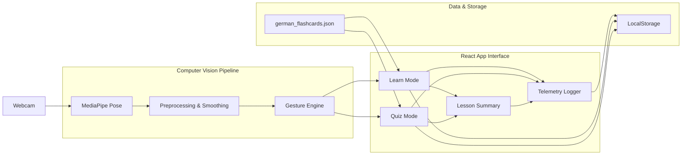
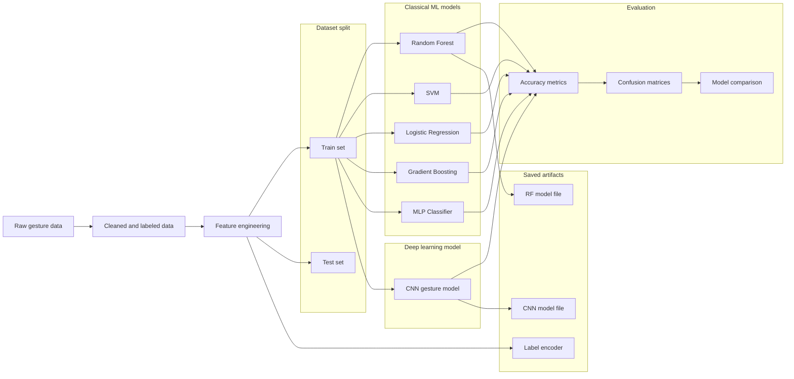
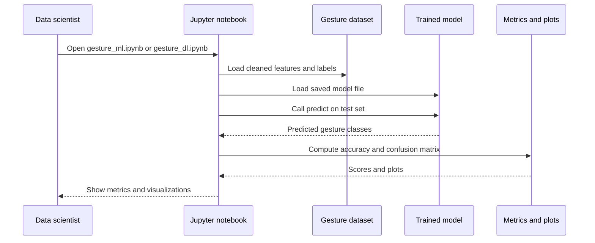

# Motion-Based Interactive German Learning App

An AI-powered, motion-based German vocabulary learning app that uses **computer vision**, **ML/DL gesture models**, and a **React + TypeScript** frontend.

Learners control flashcards using **body gestures** captured via a webcam (MediaPipe Pose), with:
- **Learn Mode**
- **Quiz Mode**
- **Spaced repetition**
- **Gesture-controlled navigation**
- **Offline ML/DL gesture experiments** (Random Forest, SVM, CNN)
- **Telemetry**, **progress tracking**, and **dark mode**

---

## 🔍 Project Overview

This project is my **MSc Data Science capstone** at the University of Europe for Applied Sciences.

The core idea:

> Use **body movement** + **computer vision** to make vocabulary learning more active, engaging, and memorable.

The system combines:

- **MediaPipe Pose** for real-time skeletal tracking in the browser  
- A **rule-based gesture engine** for stable, low-latency control  
- **Offline ML/DL gesture models** trained on a custom dataset  
- A modern **React + TypeScript** frontend with Learn / Quiz / Summary flows  

This project is intended as a portfolio piece for **Data Science**, **ML Engineer**, **AI Engineer**, and **Computer Vision** roles, showcasing:

- Applied **ML/DL**
- **Computer Vision**
- End-to-end **product-style implementation**

---

## 🧠 AI / ML / Computer Vision Highlights

### 1. Custom Gesture Dataset

- **3,017 samples**, **4 gesture classes**:  
  - NEXT  
  - PREV  
  - SELECT  
  - REST
- ~140 engineered features per sample:
  - Joint angles (e.g., shoulder–elbow–wrist)
  - Relative distances (hand-to-torso, hand-to-head)
  - Normalized coordinates
  - Symmetry features (left vs right)
- Stored and processed in the `ml/` folder as part of a reproducible pipeline.

---

### 2. Traditional ML Models

Implemented and evaluated in `ml/notebooks/gesture_ml.ipynb`:

- **Random Forest**
- **Support Vector Machine (RBF)**
- **Logistic Regression**
- **Gradient Boosting**
- **Multi-Layer Perceptron (MLP)**

Key points:

- Train / test split and cross-validation
- Performance around **~99% accuracy** on the test set
- Detailed **classification reports** and **confusion matrices**
- Models saved via `joblib` to `models/` for reproducibility

Example saved artifacts:

- `models/gesture_best_rf.joblib`
- `models/gesture_label_encoder.joblib`

---

### 3. Deep Learning (CNN)

In `ml/notebooks/gesture_dl.ipynb`:

- A compact **Convolutional Neural Network** trained on the same data representation
- Comparable performance (~99% test accuracy)
- Confusion matrix analysis to compare error patterns with classic ML models
- Model saved as `models/gesture_cnn_full.keras`

> The ML/DL models are used **offline** to explore and compare gesture recognition approaches and to demonstrate applied AI/ML skills.

---

### 4. Real-time Computer Vision Pipeline (Browser)

The **runtime app** uses a deterministic, high-confidence pipeline:

1. **Webcam stream** via `getUserMedia`
2. **MediaPipe Pose** (JS) → 33+ keypoints per frame
3. **Preprocessing**:
   - Coordinate normalization
   - Temporal smoothing & cooldown handling
4. **Rule-based gesture engine** (`frontend/src/cv/gestureEngine.ts`):
   - NEXT   → right hand raised
   - PREV   → left hand raised
   - SELECT → both hands raised
   - REST   → neutral
5. **Interaction manager**:
   - Maps gestures → app actions
   - Controls Learn / Quiz navigation in React

**Why rule-based instead of live ML in the browser?**

- Much **lower latency**, no model loading overhead
- **Deterministic**, debuggable behavior
- For these simple static gestures, rules provide near-perfect reliability
- ML models are kept for **offline experiments & documentation**

---

## 🧱 Tech Stack

### Frontend

- **React + TypeScript + Vite**
- CSS / Tailwind-style utility classes (responsive)
- Animations (card flips, feedback)
- Dark mode, gradient backgrounds, glassmorphism

### CV / AI / ML

- **MediaPipe Pose (JS)** – real-time keypoint extraction
- **Python 3.11** (offline experiments)
- **scikit-learn** – RF, SVM, LR, GB, MLP
- **TensorFlow / Keras** – CNN for gesture classification
- **Pandas, NumPy, Matplotlib, Seaborn** – EDA & visualization

### Storage & Telemetry

- **LocalStorage** for:
  - Lesson progress
  - Quiz stats
  - Gesture sensitivity settings
  - Theme preferences
- Custom **telemetry logger** to export anonymized JSON/CSV (for analysis in notebooks)

---

## 📂 Project Structure

```text
motion-edu-app/
  frontend/
    src/
      pages/
        HomePage.tsx
        LessonPage.tsx
      components/
        Flashcard.tsx
        CameraFeed.tsx
        ProgressBar.tsx
        ControlsHint.tsx
        LessonSummary.tsx
        SettingsPanel.tsx
        AppHeader.tsx
      cv/
        gestureEngine.ts
        gestureTypes.ts
        poseContext.tsx
      data/
        flashcards.ts           # Loads german_flashcards.json
      utils/
        progressStorage.ts
        quizStatsStorage.ts     # Spaced repetition stats
        telemetry.ts
    ...
  ml/
    data/
      gesture_raw/             # Raw gesture data
    notebooks/
      gesture_ml.ipynb         # scikit-learn models
      gesture_dl.ipynb         # CNN model
    scripts/
      collect_gestures.py      # Data collection helper (offline)
      train_gesture_model.py   # Training script (offline)
  models/
    gesture_best_rf.joblib     # Best ML model (example)
    gesture_label_encoder.joblib
    gesture_cnn_full.keras     # Saved CNN
  german_flashcards.json
  README.md
```

## 🎮 Features

---

### 🎯 Gesture Navigation

| Gesture         | Action            | Keyboard Equivalent  |
|-----------------|-------------------|------------------------|
| Right hand up   | NEXT              | `n` or →              |
| Left hand up    | PREVIOUS          | `p` or ←              |
| Both hands up   | SELECT / Reveal   | `s` or Space          |
| Neutral         | REST              | `r`                   |

---

### 📘 Learn Mode

- Flip flashcards  
- German → English  
- Example sentences  
- Smooth card animations  
- Gesture + keyboard input  

---

### 📝 Quiz Mode (with Spaced Repetition)

- Self-graded recall  
- Harder cards shown more often  
- Stats saved automatically  
- Gesture-based navigation  
- Keyboard fallback  
- Smooth transitions  

---

### 📊 Lesson Summary

- Score summary  
- Total correct / incorrect  
- Hardest cards list  
- Spaced repetition difficulty ranking  
- Helps with targeted revision  

---

### 📈 Telemetry

- Tracks gesture usage  
- Quiz performance analytics  
- Navigation events  
- Settings changes (dark mode, sensitivity)  
- Exportable JSON for Data Science analysis  

---

## 🧪 Running the Frontend

```bash
cd frontend
npm install
npm run dev
```

## 🧠 Running ML / DL Experiments

```bash
cd ml
python -m venv .venv
.venv\Scripts\activate     # Windows
pip install -r requirements.txt
jupyter notebook
```

Run the notebooks:

- `gesture_ml.ipynb`
- `gesture_dl.ipynb`

These produce:

- Model comparisons  
- Confusion matrices  
- Classification reports  
- Saved models (`*.joblib`, `*.keras`)

## 🧱 System Architecture (Plaintext Overview)

```plaintext
┌──────────────┐     ┌─────────────────┐     ┌────────────────────┐
│    Webcam     │ --> │ MediaPipe Pose   │ --> │ Preprocessing Layer │
└──────────────┘     └─────────────────┘     └────────────────────┘
                                                               │
                                                               ▼
                                                      ┌─────────────────┐
                                                      │ Gesture Engine  │
                                                      │  (Rule-based)   │
                                                      └─────────────────┘
                                                               │
                                                               ▼
                                                   ┌─────────────────────┐
                                                   │ React App (UI/UX)   │
                                                   ├─────────────────────┤
                                                   │ Learn Mode          │
                                                   │ Quiz Mode           │
                                                   │ Summary + Telemetry │
                                                   └─────────────────────┘
```
### 🧱 System Architecture (Mermaid)



### 🧠 ML / DL Offline Pipeline (Mermaid)



### 🔁 Sequence Diagram for ML Inference (Offline Experiment Flow)



### 🔄 Training Pipeline vs Runtime Pipeline

```mermaid
flowchart TB

    %% -------- TRAINING PIPELINE -------- %%
    subgraph TrainingPipeline[Offline Training Pipeline]
        TP1[Raw Gesture Data]
        TP2[Cleaning and Labeling]
        TP3[Feature Engineering]
        TP4[Train Test Split]
        TP5[Train Classical ML Models]
        TP6[Train CNN Model]
        TP7[Model Evaluation]
        TP8[Save Model Artifacts]
    end

    %% -------- RUNTIME PIPELINE -------- %%
    subgraph RuntimePipeline[Browser Runtime Pipeline]
        RP1[Webcam Input]
        RP2[MediaPipe Pose]
        RP3[Preprocessing and Smoothing]
        RP4[Rule Based Gesture Engine]
        RP5[React App UI]
        RP6[LocalStorage Persistence]
    end

    %% TRAINING FLOW %%
    TP1 --> TP2 --> TP3 --> TP4
    TP4 --> TP5 --> TP7
    TP4 --> TP6 --> TP7
    TP7 --> TP8

    %% RUNTIME FLOW %%
    RP1 --> RP2 --> RP3 --> RP4 --> RP5 --> RP6
```



---

## 🎯 What This Demonstrates

### 🧠 AI / ML Engineering
- Full ML pipeline: **data → features → models → evaluation**
- Classical ML + Deep Learning (**scikit-learn + TensorFlow**)
- Confusion matrices & classification reports
- Model comparison & selection
- Offline experimentation & documentation
- Understanding latency vs. accuracy trade-offs in gesture systems

---

### 👁 Computer Vision Engineering
- Real-time **human pose estimation** with MediaPipe
- Gesture classification (rule-based + ML models)
- Landmark normalization, smoothing, temporal filtering
- Low-latency inference optimizations
- Interaction design for embodied learning

---

### 💻 Software Engineering
- Full **React + TypeScript** architecture
- Component-based UI design
- Custom hooks & context providers
- LocalStorage persistence (progress, stats, preferences)
- Responsive UI, dark mode, animations
- Telemetry export system

---

### 📚 Learning Science Integration
- **Spaced repetition** algorithm
- Difficulty ranking for flashcards
- Lesson summary analytics
- Embodied active recall (gestures + movement)

---

### 🎓 Relevant Roles This Project Fits
- **Machine Learning Engineer**
- **AI Engineer**
- **Computer Vision Engineer**
- **Data Scientist (Applied / Product)**
- **Full-Stack ML Developer**

---

## 🌱 Future Improvements
- In-browser ML inference (**TensorFlow.js / TFLite Web**)
- AR overlays (**Three.js / AR.js**)
- Speech recognition for pronunciation feedback
- Backend + cloud sync (user profiles, progress history)
- Multi-language learning support (Spanish, French, Hindi)
- Mobile version (React Native or Flutter)


